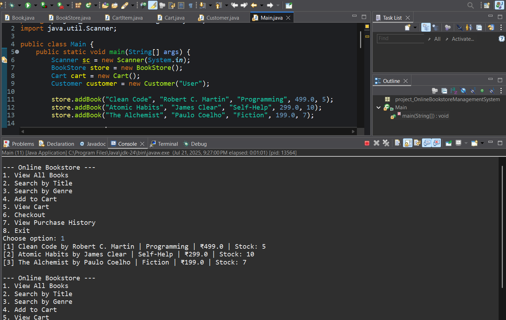
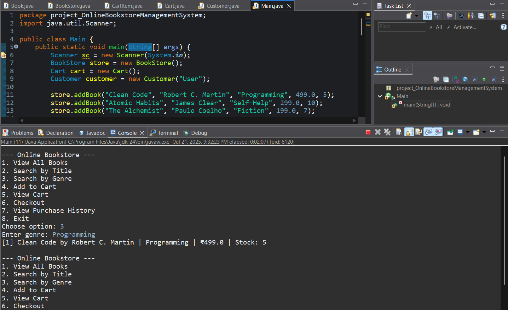
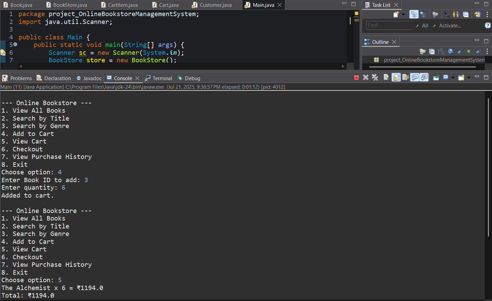
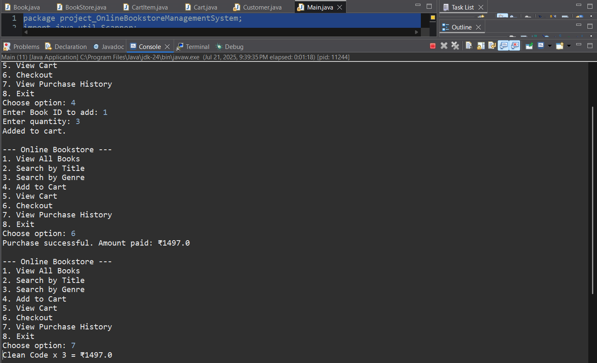

# 📚 Online Bookstore Management System (Java - Console Based)

## 🧾 Description

A simple **console-based Java application** to manage an online bookstore using **pure OOP concepts** and **Java Collections**. Users can **browse books**, **search by title or genre**, **add to cart**, and **checkout with purchase history tracking**.

---

## 🛠️ Technologies Used

- **Java (Core)**
- **OOP Principles** (Encapsulation, Abstraction, Object Interaction)
- **Collections Framework** (`ArrayList`, `HashMap`)
- **Console Input/Output**

---

## 🎯 Features

- Browse all available books (title, author, genre, price, stock)  
- Search books by **title** or **genre**  
- Add books to a **shopping cart**  
- View cart items and calculate total bill  
- Checkout and store purchase in history  
- View all past **purchase history**

---

## 📂 Project Structure

src/  
├── Book.java — Book model class   
├── BookStore.java — Catalog and search logic    
├── CartItem.java — Represents an item in the cart    
├── Cart.java — Handles cart operations  
├── Customer.java — Purchase and history logic  
└── Main.java — Entry point (menu and user interaction)  

---

## ▶️ How to Run

1. Clone this repo  
2. Open in Eclipse/IntelliJ or any IDE  
3. Compile and run `Main.java`  
4. Use console menu to interact with the system

---

## 🧠 Learning Outcomes

- Apply **pure OOP design** with multiple interacting classes  
- Use **collections** to manage dynamic data  
- Implement **menu-driven console programs**  
- Handle real-world scenarios like cart, billing, and history tracking

---

## 📸 Sample Output

### 📘 Book List

### 🔍 Search Result

### 🛒 Cart View

### 💳 Purchase History

> 📁 Make sure all screenshots are stored in a folder named `images/` inside your project.

---

## 👤 Author

**Arpit Dhakar**  
B.Tech Student | Aspiring Java Developer  
🔗 [LinkedIn](https://www.linkedin.com/in/arpit-dhakar-5470672b5/)  
💻 [GitHub](https://github.com/arpit1674)

---

## ⭐️ Show Your Support

If you like this project, feel free to **star the repository** and share it!
